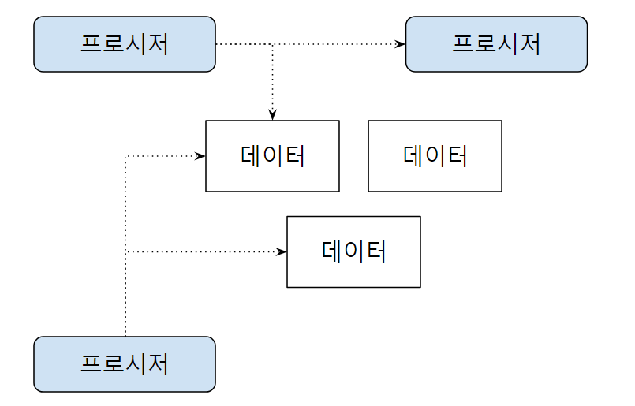
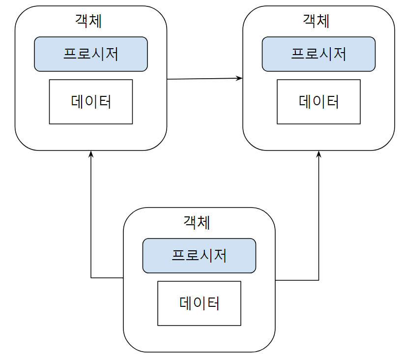

# Chapter02 - 객체지향

## 1. 객체지향 vs 절차지향
### 1.1 절차지향
<br>
- 절차지향은 데이터를 중심으로한 프로시저(procedure)로 구성된다.
- 프로시저는 데이터를 이용해서 기능을 구현하며, 필요에따라 다른 프로시저를 사용하기도 한다.
- 다수의 프로시저들이 데이터를 공유하는 방식으로 만들어진다. 
  - 1. 데이터 타입이나 의미를 변경할때, 수정해야할 프로시저가 증가한다.
  - 2. 같은 데이터를 프로시저들이 서로 다른 의미로 사용하는 경우가 발생한다.

### 1.2 객체지향
<br>
- 객체지향은 데이터와 관련된 프로시저를 객체라는 단위로 묶는다.
- 객체는 자신만의 '기능'을 제공하며, 객체들은 다른 객체의 기능을 사용할 수 있다.
- 프로시저는 자신이 속한 객체의 데이터만 접근할 수 있다. 다른 객체의 데이터에 접근 할 수 없다.
- 요구사항의 변화에 더 유연하게 대처할 수 있다. 구조가 절차지향에 비해 복잡하다.

## 2. 객체
### 2.1 객체의 핵심은 기능을 제공하는 것
- 객체지향에서 중요한 것은 객체가 제공하는 기능이다.

### 2.2 인터페이스
- 객체가 제공하는 기능은 세가지로 구성되어있다.
    - 1. 식별자 (메서드명)
    - 2. 파리미터 및 파라미터 타입
    - 3. 기능 실행 결과 값 (리턴 값)
- 객체가 제공하는 모든 기능의 집합을 <strong>인터페이스</strong> 라고 한다.
- 클래스는 객체를 구현하고 정의하는 역할을 한다.

### 2.3 메시지
- 객체와 객체는 메시지를 통해 상호작용한다.
- 객체가 다른 객체에게 기능의 실행을 요청하는 것을 메시지를 보낸다고 표현한다.
- 메시지에는 명시적 메시지와 암시적 메시지가 있다.
    - 명시적 메시지는 한 객체가 다른 객체의 메서드를 호출하는 형태로, 직접적인 실행 요청을 의미한다.
    - 암시적 메시지는 객체가 다른 객체의 상태 변화를 감지하고 자동으로 반응하는 것을 의미한다.
- 메시지는 메서드 호출로 구체화되며, 이때 메시지 송신자는 메시지 수신자에게 특정 기능을 수행하도록 요청한다.
- 메시지를 통해 객체 간 결합도를 낮출 수 있다. 인터페이스를 통해 기능을 사용할 수 있으므로, 유지보수성과 확장성이 향상된다.

## 3. 객체의 책임과 크기
- 객체가 시스템 내에서 맡은 역할이나 의무가 책임이다.
- 책임을 수행하기 위한 작은 조각이 기능 (메서드)이다.
- 객체가 갖는 책임은 작아야 한다. 단일책임의 원칙 (SRP)<br> 책임이 작으면 변경에 유리하다.

## 4. 의존
- 객체가 다른 객체를 의존하는 경우는 세가지가 있다.
  - 1. 객체가 다른 객체를 생성할 때
  - 2. 다른 객체의 메서드를 호출할 때
  - 3. 파라미터로 전달받은 객체를 사용할 때
- 객체가 다른 객체를 의존하게 되면, 의존하는 객체도 함께 변경가능성이 증가한다. 
- a -> b -> c -> a 처럼 순환 의존의 경우 심각한 영향을 줄 수 있다. 의존 역전 원칙 (DIP)를 지키자

## 5. 캡슐화
- 캡슐화는 내부적으로 기능을 어떻게 구현하는지를 감추는 것을 말한다.
- 기능이 변경되더라도 사용하는 코드는 영향을 받지 않게 해준다.

```java
public class Member {
    ...// 다른 데이터
    private Date expiryDate;
    private boolean male;
    
    public Date getExpritydate() {
        return expritydate;
    }
    
    public boolean inMale() {
        return male;
    }
}
```
```java
if (member.getExpiryDate() != null && member.getExpiryDate().getDate() < System.currentTimeMillis()) {
    // 만료 되었을 때의 처리
}
```
다음과 같은 Member 코드가 있을때, 만료 여부를 활용하는 코드는 여러코드에서 사용된다. 
만료 여부를 활용하는 코드가 변경되면 사용되는 모든 부분을 찾아서 일일이 수정해야 할것이다. 
하지만 캡슐화를 잘 활용하면 사용하는 코드는 변경되지 않도록 할 수 있다.
```java
public class Member {
    private static final long DAY30 = 1000 * 60 * 24 * 30; // 30일
    ...// 다른 데이터
    private Date expiryDate;
    private boolean male;
    
    public boolean isExpired() {
        if (male) {
            return expiryDate != null 
                    && expiryDate.getDate() < System.currentTimeMillis();
        }
        return expriyDate != null 
                && expiryDate.getDate() < System.currentTimeMillis() - DAY30;
    }
}
```
Member 객체에 직접 만료여부 확인 코드를 정의하면 만료확인 코드가 변경되었지만,
이를 메시지를 보내 사용하는 다른 객체는 변경에 영향을 받지 않게 된다.

### 5.1 캡슐화를 위한 두가지 규칙
1. Tell, Don't ASk
    - 데이터를 묻지 말고, 기능을 요청하라, 자연스럽게 해당 기능이 캡슐화 된다.
```java
if (member.getExpiryDate() != null && member.getExpiryDate().getDate() < System.currentTimeMillis()) {
// 만료 되었을 때의 처리
}
```
위 코드는 Member 객체로 부터 데이터를 getExpiryDate() 로 직접 가져온다. 이렇게 하지 말고 Member.isExpired() 메서드를 호출하자

2. 데미테르의 법칙
    - 메서드에서 생성한 객체의 메서드만 호출
    - 파라미터로 받은 객체의 메서드만 호출
    - 필드로 참조하는 객체의 메서드만 호출
```java
    public void processSome(Member member) {
        if (member.getDate().getTime()) {}
    }
```
위 코드는 데미테르 법칙을 위반한다. <br>
파라미터로 전달받은 Member 객체의 getDate() 를 통해
Date 객체에 getTime() 메서드를 호출했다.
<br>
데미테르 법칙을 따르려면 member 객체에 대한 한 번의 메서드 호출로 변경해주어야 하며,<br> 기능중심으로 코드를 작성하도록 하기때문에 캡슐화를 향상시킨다.

## 6. 객체 지향 설계 과정

1. 제공해야 할 기능을 찾고 또는 세분화하고, 그 기능을 알맞은 객체에 할당한다.
    - 1. 기능을 구현하는데 필요한 데이터를 객체에 추가한다.<br> 객체에 데이터를 먼저 추가하고 그 데이터를 이용하는 기능을 넣을 수도 있다.
    - 2. 기능은 최대한 캡슐화 해서 구현한다.
2. 객체간에 어떻게 메시지를 주고받을지 결정한다.
3. 과정1과 과정2를 개발하는 동안 지속적으로 반복한다.

- 객체설계는 한번에 완성되지 않고 구현을 진행해 나가면서 점진적으로 완성된다.
- 설계를 할때는 변경되는 부분을 고려한 유연한 구조를 갖도록 노력해야한다.
