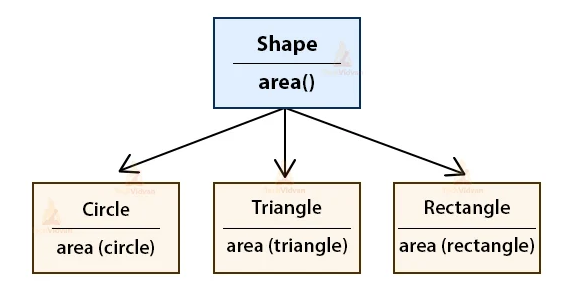

# 3장 다형성과 추상 타입

객체지향은 캡슐화, 추상화를 통해 구현 변경의 유연함을 제공한다. 추상화에 대해서 알아보자

## 1. 상속 개요
상속은 하나의 타입을 그대로 사용하면서 구현을 추가할 수 있도록 해주는 방법을 제공한다.

```java
public class Coupon {
    private int discountAmount;

    public Coupon(int discountAmount) {
        this.discountAmount = discountAmount;
    }

    public int getDiscountAmount() {
        return discountAmount;
    }
    
    public int calculateDiscountAmount(int price) {
        if (price < discountAmount) {
            return 0;
        }
        return price - discountAmount;
    }
}
```
```java
public class LimitPriceCoupon extends Coupon {
    private int limitPrice;

    public LimitPriceCoupon(int limitPrice, int discountAmount) {
        super(discountAmount);
        this.limitPrice = limitPrice;
    }

    public int getLimitPrice() {
        return limitPrice;
    }
    
    @Override
    public int calculateDiscountAmount(int price) {
        if (price < limitPrice) {
            return price;
        }
        return super.calculateDiscountAmount(price);
    }
}
```
```java
LimitPriceCoupon lpCounpon = new LimitPriceCoupon(5000, 1000);
int discountAmount = lpCoupon.getDiscountAmount(); // Coupon 클래스에서 물려받음
int limitPrice = lpCoupon.getLimitPrice(); // LimitPriceCoupon 클래스에 정의
```
## 2. 다형성과 상속

- 다형성 : 한 객체가 여러가지 타입을 가질 수 있다는 것
```java
public class Plane {
    public void fly() {
        // 비행
    }
}

public interface Turbo {
    public void boost();
}

public class TurboPlane extends Plane implements Turbo {
    public void boost() {
        // 가속
    }
}
```
```java
TurboPlane tp = new TurboPlane();
tp.fly(); // Plane에 정의/구현된 메서드 실행
tp.boost(); // Turbo에 정의되고 TurboPlane에 구현된 메서드 실행
```
```java
TurboPlane tp = new TurboPlane();
Plane p = tp; // TurboPlane 객체는 Plane 타입도 된다.
p.fly();

Turbo t = tp; // TurboPlane 객체는 Turbo 타입도 된다.
t.boost();
```

## 2.1 인터페이스 상속과 구현 상속
- 인터페이스 상속 : 클래스가 특정 인터페이스를 구현(implements)하는 것을 의미한다. 타입의 정의만을 상속받는다.
  - Turbo 인터페이스가 있고, TurboPlane이 이를 구현한다면, TurboPlane은 반드시 boost() 메서드를 구현해야 한다.

- 구현 상속 : 상위클래스의 기능을 재사용하기위해 사용한다. 
  - TurboPlane 클래스는 Plane 클래스로부터 fly() 메서드를 상속받아 사용할 수 있다.

## 3. 추상타입과 유연함