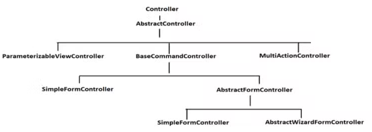

# 4장 재사용: 상속보단 조립

- 상속을 사용하면, 재사용을 쉽게 할 수 있지만 몇가지 문제점이 생긴다.<br>
상속을 통한 재사용 과정에서 발생할 수 있는 문제점을 살펴보고, <br>
객체 조립을 통해 상속을 통한 재사용의 단점을 해소하는 방법을 살펴보자<br>

## 1. 상속과 재사용
### 1.1 상위 클래스 변경의 어려움

- 어떤 클래스를 상속받는다는 것은 그 클래스에 의존하는 것이다.<br> 
의존하는 클래스의 코드가 변경되면 영향을 받을 수 있다.
- 클래스 계층도가 커질수록 상위클래스 변경의 영향이 더욱 커지고, 변경이 어려워진다.

### 1.2 클래스의 불필요한 증가
- 유사한 기능을 확장하는 과정에서 클래스의 개수가 불필요하게 증가할 수 있다.

### 1.3 상속의 오용
- 상속 자체를 잘못 사용할 수 있다.
```java
public class Container extends ArrayList<Luggage> {
    private int maxSize;
    private int currentSize;
    
    public Container(int maxSize) {
        this.maxSize = maxSize;
    }
    
    public void put(Luggage lug) throws NotEnoughSpaceException {
        if (!canContain(lug)) {
            throw new NotEnoughSpaceException();
        }
        super.add(lug);
        currentSize += lug.size();
    }
    
    public void extract(Luggage lug) {
        super.remove(lug);
        this.currentSize -= lug.size();
    }
    
    public boolean canContain(Luggage lug) {
        return maxSize >= currentSize + lug.size();
    }
}
```
- 수화물 넣기, 빼기, 공간확인 기능을 가진 클래스가 있다. ArrayList를 상속받아 사용한다.<br>

```java
Luggage size3Lug = new Luggage(3);
Luggage size2Lug = new Luggage(2);
Luggage size1Lug = new Luggage(1);

Container c = new Container(5);
if (c.canContain(size3Lug)) {
    c.put(size3Lug); // 정상 사용
}
if (c.canContain(size2Lug)) {
    c.add(size2Lug); // ArrayList의 add() 비정상 사용
}
```
- ArrayList를 상속하는 바람에 ArrayList의 add 메서드를 혼용해서 사용할 위험이 생긴다.
- list.add(luggage)로 추가하면 Container의 공간 제한 기능이 무용지물이 된다.

## 2. 조립을 이용한 재사용
- 필드에서 다른 객체를 참조하는 방식으로 구현된다.
```java
public class FlowController {
    private Encryptor encryptor = new Encrytor(); // 필드로 조립
    
    public void process() {
        ...
        byte[] encryptedData = encryptor.encrypt(data);
        ...
    }
}
```
- 다른객체를 필드로 가지면 다른 객체의 기능을 사용할 수 있다.
- 기능이 추가되더라도 하위 클래스가 증가하지 않아도 된다.
- 런타임에 조립 대상 객체를 교체할 수 있다.
  (아래 코드에서 파라미터를 통해 Compressor 객체를 런타임에 변경할 수 있다.)
```java
public class Storage {
    private Compressor compressor = new Compressor();

    public voiid setCompressor(Compressor compressor) {
        this.compressor = compressor;
    }
}
```
- 상속보다는 조립을 우선적으로 고려하자

### 2.1 위임
- 위임 : 내가 할 일을 다른 객체에 넘긴다
- 조립방식을 이용해서 위임을 구현한다.
  - 아래 코드는 bounds 객체에 포인터 위치 확인 기능을 위임하고 있다.
```java
public abstract class Figure {
    private Bounds bounds = new Bounds(); // 위임 대상을 조립 형태로 가짐
    ...
    private void changeSize() {
        // 크기 변경 코드 위치
        bounds.set(x, y, width, height);
    }
     
    public boolean contains(Point point) {
        // bounds 객체에 처리를 위임함
        return bounds.contains(point.getX(), point.getY());
    }
}
```
- 위임은 반드시 필드로 정의할 필요는 없다. 메서드 내에서 생성해서 요청을 전달 할 수도 있다.
```java
public abstract class Figure {
    public boolean contains(Point point) {
        Bounds bounds = new Bounds(x, y, width, height);
        return bounds.contains(point.getX(), point.getY());
    }
}
```

### 2.2 상속은 언제 사용할까?
- 상속은 재사용이 아닌, 기능의 확장이 필요할때 사용한다.
- 명확한 IS-A 관계가 성립해야 한다.
- 상위클래스의 기본적인 기능을 그대로 유지하면서, 그 기능을 확장해 나갈때 사용한다.
- 상속의 단점이 발생한다면, 조립을 사용하는것을 고려하자