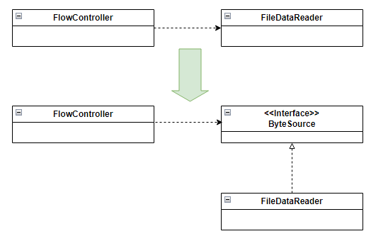

## 4. 인터페이스 분리원칙 (Inteface segregation principle)
- 자신이 사용하는 메서드에만 의존해야 한다.

### 4.2 인터페이스 변경과 그 영향
- 인터페이스 분리 원칙은 단일책임의 원칙과도 연결된다. 
- 인터페이스 분리 원칙은 클라이언트 입장에서 인터페이스를 분리하라는 원칙

## 5. 의존 역전 원칙 (Dependency inversion principle)
- 고수준 모듈은 저수준 모듈의 구현에 의존해서는 안된다. 저수준 모듈이 고수준 모듈에서 정의한 추상타입에 의존해야 한다.
  - 고수준 모듈 : 의미 있는 단일 기능을 제공하는 모듈 (ex : 바이트 데이터를 읽고 암호화한뒤 쓴다.)
  - 저수준 모듈 : 고수준 모듈을 구성하는 하위기능 모듈 (ex : 데이터 읽기, 암호화, 쓰기)

### 5.1 추상화 의존
- 
- 고수준 모듈과 저수준 모듈이 모두 추상 타입에 의존하도록 바꾼다.

### 5.2 의존 역원 원칙과 패키지
- 의존 역전 원칙은 타입의 소유도 역전시킨다.
  - (FileDataReader 타입을 ByteSource 상위 모듈이 소유하게 된다.)
  - 독립적인 배포가 가능하게 된다. ByteSource 구현 클래스만 변경하면 됨
- 의존 역전 원칙은 개방폐쇄 원칙을 클래스 수준뿐만 아니라 패키지 수준까지 확장시켜주는 디딤돌이 된다.

# SOLID 원칙 정리
- 변화에 유연하게 대처할 수 있는 설계 원칙이다.
- 사용자 관점에서의 설계를 지향한다. 인터페이스 분리 원칙은 클라이언트 입장에서 인터페이스를 분리한다.
- 단일 책임 원칙, 인터페이스 분리 원칙 => 객체가 커지지 않도록 막는다.
- 리스코프 치환 원칙, 의존 역전 원칙 => 개방 폐쇄 원칙을 지원한다.