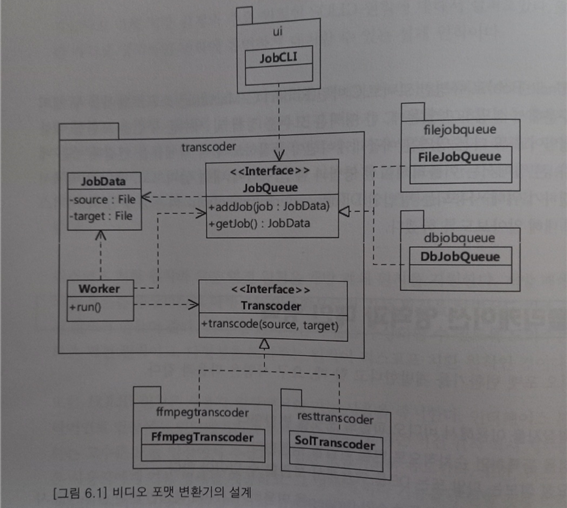

# 6장 DI(Dependency Injection)와 서비스 로케이터
- 어플리케이션 영역 : 고수준 정책 및 저수준 구현을 포함한 영역 (기능 구현)
- 메인 영역 : 어플리케이션이 동작하도록 각 객체들을 연결해주는 영역 (객체의 연결)
- 메인 영역에서 객체를 연결하기 위한 방법으로 'DI' 와 '서비스 로케이터'가 있다.

## 6.1 어플리케이션 영역과 메인 영역

- Worker와 JobCLI 가 동작하기 위해서는 JobQue, Transcoder 실제 객체를 구할 방법이 필요하다<br>
이를 위해 Locator 객체를 사용해보자

```java
public class Locator {
    private static Locator instance;

    private jobQueue jobQueue;
    private Transcoder transcoder;

    public static Locator getInstance() {
        return instance;
    }

    public static void init(Locator locator) {
        instance = locator;
    }
    
    public Location(JobQueue jobQueue, Transcoder transcoder) {
        this.jobQueue = jobQueue;
        this.transcoder = transcoder;
    }
    
    public JobQueue getJobQueue() {return jobQueue;}
    public Transcoder getTranscoder() {return transcoder;}
}
```
```java
public class Worker {
    public void run() {
        JobQueue jobQueue = Locator.getInstance().getJobQueue();
        Transcoder transcoder = Locator.getInstance().getTranscoder();
        
        // 비지니스 로직
    }
}

public class JobCLI {
    public void interact() {
        JobQueue jobQueue = Locator.getInstance().getJobQueue();
        jobQueue.addJob(new JobData(source, target));
    }
}
```
```java
public class Main {
    public static void main(String[] args) {
        // 상위 수준 모듈인 transcoder 패키지에서 사용할 
        // 하위 수준 모듈 객체 생성
        JobQueue jobQueue = new FileJobQueue();
        Transcoder transcoder = new FfmpegTranscoder();
        
        // 상위 수준 모듈이 하위 수준 모듈을 사용할 수 있도록 Locator 초기화
        Locator locator = new Locator(jobQueue, transcoder);
        Locator.init(locator);
        
        // 상위 수준 모듈 객체를 생성하고 실행
        final Worker worker = new Worker();
        worker.run();

        JobCLI cli = new JobCLI();
        cli.interact();
    }
}
```
- Main 영역코드는 어플리케이션 영역의 객체를 초기화, 의존처리, 실행을 담당한다.
  - 모든 의존은 메인 영역으로 향한다. 메인 영역을 변경해도 어플리케이션 영역은 변경되지 않는다.
- Main 은 Locator 를 이용하여 필요한 객체를 가져왔다. <br>
객체를 제공하는 책임을 가지는 객체를 서비스 로케이터 (ServiceLocator)라고 한다.
  - 서비스 로케이터는 단점이 있다. (테스트, 의존성 숨김, 전역상태 문제) 일반적으로 DI를 많이 사용한다.

## 6.2 DI(Dependency Injection) 이용한 의존 객체 사용
- DI는 필요한 객체를 외부에서 주입하는 방식이다.
- DI를 통해서 의존 객체를 관리할때에는 의존 관계에 따라 연결해 주는 조립기능이 필요하다.
- 스프링 프레임 워크는 DI 기능을 제공하는 대표적인 프레임워크다.

```java 
public class Worker {
    private JobQueue jobQueue;
    private Transcoder transcoder;

    // 외부에서 사용할 객체를 전달받을 수 있는 방법 제공 (생성자 주입)
    public Worker(JobQueue jobQueue, Transcoder transcoder) {
        this.jobQueue = jobQueue;
        this.transcoder transcoder;
    }
    public void run() {
        // 비지니스 로직
    }
}
```
```java
public class JobCLI {
    private JobQueue jobQueue;
    
    // 외부에서 사용할 객체를 전달받을 수 있는 방법 제공 (생성자 주입)
    public JobCLI(JobQueue jobQueue) {
        this.jobQueue = jobQueue;
    }

    public void interact() {
        // 비지니스 로직
    }
}
```
```java
public class Main {
    public static void main(String[] args) {
        // 상위 수준의 모듈인 transcoder 패키지에서 사용할 
        // 하위 수준의 모듈 객체 생성
        JobQueue jobQueue = new FileJobQueue();
        Transcoder transcoder = new FfmpegTranscoder();
        
        // 상위 수준 모듈 객체를 생성하고 실행
        final Wordker wordker = new Worker(jobQueue, transcoder);
        worker.run();

        JobCLI cli = new JobCLI(jobQueue);
        cli.interact();
    }
}
```

### 6.2.1 생성자 방식과 설정 메서드 방식
- DI 적용하기 위한 두가지 방식
  - 생성자 방식 : 객체를 생성하는 시점에 필요한 모든 의존 객체를 준비할 수 있다. (선호되는 방법)
  - 메서드 방식 : 객체를 생성한 뒤에 의존 객체를 주입한다. 실행중 NullPointException 발생 위험성
```java
public class Worker {
    private JobQueue jobQueue;
    private Transcoder transcoder;
    
    // 메서드 방식의 DI
    public void setJobQueue(JobQueue jobQueue) {
        this.jobQueue = jobQueue;
    }
    // 메서드 방식의 DI (메서드 체이닝)
    public Worker setTranscoder(Transcoder transcoder) {
        this.transcoder = transcoder;
        return this;
    }
    
    public void run() {
        while (someRunningCondition) {
            JobData jobData = jobQueue.getJob();
            transcoder.transcode(jobData.getSource(), jobData.getTarget());
        }
    }
}
```

### 6.2.2 DI와 테스트
- DI 를 사용하면 테스트하기 편한 코드를 작성할 수 있다.
```java
// 테스트 코드에서 Mock 객체를 만들어 전달하기가 쉽다.
@Test
public void shouldRunSuccessFully() {
    JobQueue mockJobQueue = ... // Mock 등을 이용해서 Mock 객체 생성
    Transcoder mockTranscoder = ... // Mock 객체 생성
    
    Worker worker = new Worker();
    worker.setJobQueue(mockJobQueue);
    worker.setTranscoder(mockTranscoder);
    worker.run(); // Mock 객체를 이용한 실행
}
```

### 6.2.3 스프링 프레임 워크와 DI
- 스프링 프레임워크는 생성자, 메서드 방식을 모두 지원한다.
- XML 파일이용하는 방식 -> 자바코드를 이용한 방식

```java
import org.springframework.context.annotation.Bean;

@Configuration
public class TransconderConfig {
  @Bean
  public JobQueue fileJobQueue() {
    return new FileJobQueue();
  }

  @Bean
  public Transcoder transcoder() {
      return new FfmpegTranscoder();
  }

  @Bean
  public Worker worker() {
      return new Worker(fileJobQueue(), ffmpegTranscoder());
  }
  
  @Bean
  public JobCLI jobCLI() {
      jobCLI jobCli = new JobCLI();
      jobCli.setJobQueue(fileJobQueue());
      return jobCli;
  }
}
```