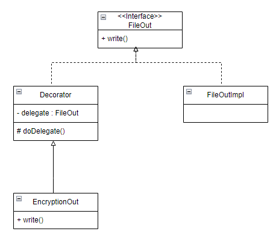

# 데코레이터 패턴
- 상속을 이용한 기능 확장 방법은 쉽지만, 다양한 조합의 기능조합이 요구될때<br>
클래스가 불필요하게 증가하는 문제가 있다.<br>
  
- 데코레이터 패턴은 상속이 아닌 위임의 방식으로 기능을 확장한다. <br>
  별도의 Decorator 추상 클래스를 만든다.<br>
```java
public abstract Decorator implements FileOut {
    private FileOut delegate; // 위임대상

    public Decorator(FileOut delegate) {
        this.delegate = delegate;    
    }    
    
    protected void doDelegate(byte[] data) {
        delegate.write(data); // delegate에 쓰기 위임    
    }
}
```
```java
public class EncryptionOut extends Decorator {
    
    public EncryptionOut(FileOut delegate) {
        super(delegate);
    }
    
    public void write(Byte[] data) {
        bvyte[] encryptionData = encrypt(data);
        super.doDelegate(encryptedData);
    }
    
    private byte[] encrypt(byte[] data) {
        ...
    }
}
```
- 위 코드는 Decorator 클래스를 상속받는다. 이 클래스는 자신의 기능을 수행한 뒤에 상위 클래스의 <br>
doDelegate() 메서드를 이용해서 파일 쓰기를 위임하도록 구현한다.<br>
```java
FileOut delegate = new FileOutImpl();
FileOut fileOut = new EncryptionOut(delegate);
fileOut.write(data);
```
- 데코레이터 패턴은 조합하는 방식으로 기능을 확장 할 수 있다.<br>
기능 적용의 순서도 자유롭게 변경할 수 있다.
```java
// 버퍼 -> 암호화 -> 압축 -> 파일 쓰기
FileOut fileOut = new BufferedOut(EncrptionOut(new ZipOut(delegate)));

// 암호화 -> 압축 -> 버퍼 -> 파일 쓰기
FileOut fileOut = new EncryptionOu(new ZipOut(new BufferedOut(delegate)));
```

## 데코레이터 패턴을 적용할 때 고려할 점
- 데코레이터 패턴을 구현할때 정의되어 있는 메서드가 증가하게 되면 그 만큼 데코레이터의 구현도 복잡해진다.
- 여러개의 데코레이터 객체가 사용될때 그 중 하나가 비정상적으로 작동하면 어떻게 처리할 지 고려해야한다.<br>
필수적인 기능의 문제라면 예외를 발생시킨다. 반면 부가적인 기능이라면 로그를 남기고 사후처리를 할 수도 있다. 
- 클라이언트 입장에서 데코레이터 객체와 실제 구현 객체의 구분이 되지 않기 때문에 코드만으로 기능작동을 이해하기 어렵다.
```java
public class ImageSource {
    
    public void writeTo(FileOut out) {
        out.write(imagedata);
    }
    ...
}
```
- 위 코드에서 writeTo() 메서드는 파라미터로 전달받은 FileOut 객체를 사용하는데,<br>
writeTo() 메서드는 이 FileOut 객체가 단순히 파일에 쓰기만 하는지 아니면 압축을 하는지 등의 여부를 알 수 없다.