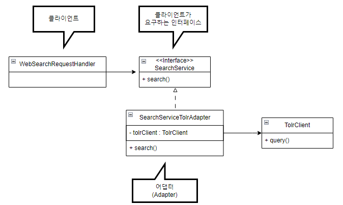
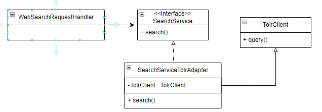

# 어댑터 패턴
- 클라이언트가 요구하는 인터페이스와 재사용하려는 모듈의 인터페이스가 일치하지 않을때 사용하는 패턴<br>
<br>
- 사용자가 정의한 SearchService 인터페이스와<br>
검색 모듈 TolrClient의 인터페이스가 맞지 않아서<br>
SearchServiceToLrAdapter 어댑터 패턴을 사용한 모습이다.
```java
public class SearchServiceTolrAdapter implements SearchService {
    private TolrClient tolrClient = new TolrClient();
    
    public SearchResult search(String keyword) {
        // keyword를 tolrClient가 요구하는 형식으로 변환
        TolrQuery tolrQuery = new TolrQuery(keyword);
        // TolrClient 기능 실행
        QueryResponse response = tolrClient.query(tolrQuery);
        // TolrClient의 결과를 SearchResult로 변환
        SearchResult result = convertToResult(response);
        return result;
    }
    
    private SearchResult convertToResult(QueryResponse response) {
        List<TolrDocument> tolrDocs = response.getDocumentList().getDocuments();
        List<SearchDocument> docs = new ArrayList<SearchDocument>();
        for (TolrDocument tolrDoc : tolrDocs) {
            docs.add(new SearchDocument(tolrDoc.getid()));
        }
        return new SearchResult(docs);
    }
}
```
- SearchServiceTolrAdapter 클래스는 SearchService 인터페이스를 구현하고 있으므로,<br>
클라이언트 클래스 코드 수정없이 TolrClient를 이용한 통합 검색으로 구현을 변경할 수 있게 된다.
- 어댑터 패턴이 적용된 예는 SLF4J 로깅 프레임워크가 있다.<br>

## 상속을 이용한 어댑터 패턴
<br>
- 상속을 이용하여 어댑터 패턴을 구현할 수도 있다. <br>
상위 클래스의 메서드를 호출하는 방식으로 코드를 작성해야 한다.<br>
```java
public class SearchServiceTolrAdapter extends TolrClient 
        implements SearchService {
    private TolrClient tolrClient = new TolrClient();
    
    public SearchResult search(String keyword) {
        // keyword를 tolrClient가 요구하는 형식으로 변환
        TolrQuery tolrQuery = new TolrQuery(keyword);
        // TolrClient 기능 실행
        QueryResponse response = super.query(tolrQuery);
        // TolrClient의 결과를 SearchResult로 변환
        SearchResult result = convertToResult(response);
        return result;
    }
    
    private SearchResult convertToResult(QueryResponse response) {
        List<TolrDocument> tolrDocs = response.getDocumentList().getDocuments();
        List<SearchDocument> docs = new ArrayList<SearchDocument>();
        for (TolrDocument tolrDoc : tolrDocs) {
            docs.add(new SearchDocument(tolrDoc.getid()));
        }
        return new SearchResult(docs);
    }
}
```
- 클라이언트가 사용하는 SearchService가 인터페이스가 아닌 추상클래스라면,<br>
자바 같이 단일 상속만을 지원하는 언어에서는 클래스 상속을 이용한 어댑터 구현에 제약이 있다.<br>