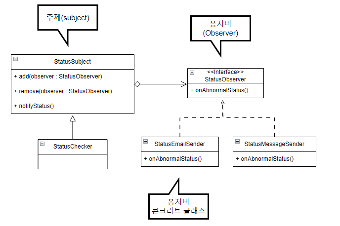

# 옵저버 패턴
- 한 객체의 상태 변화를 정해지지 않은 여러 다른 객체에 통지하고 싶을 때 사용하는 패틴이다.
- 웹사이트의 상태를 확인해서 응답 속도가 느려지거나 연결이 안되면 이메일,SMS로 통지해주는 시스템을 만들어보자
```java
public class StatusChecker {
    private EmailSender emailSender;
    private SmsSender smsSender;
    
    public void check() {
        Status status = loadStatus();
        
        if (status.isNotNormal()) {
            emailSender.sendEmail(status);
            smsSender.sendSms(status);
        }
    }
}
```
- 이 구조의 문제점은 시스템의 문제상황을 알려주는 방식이 추가될때 마다 StatusChecker 클래스도 함께변경된다.
- 이런 상황에서 임의의 객체에 상태변화를 전달할때 옵저버 패턴이 사용된다.<br>


- 옵저버 패턴은 크게 주제 객체와 옵저버 객체가 등장하는데, 주제 객체는 두가지 책임을 갖는다.
  - 옵저버 목록을 관리하고, 옵저버를 등록하고 제거할 수 있는 메서드를 제공한다.
  - 상태의 변경이 발생하면 등록된 옵저버에 변경 내역을 알린다.

```java
public abstract class StatusSubject {
    // 옵저버 목록을 가진다.
    private List<StatusObserver> observers = new ArrayList<StatusObserver>();
    // 옵저버 목록에 옵저버를 등록
    public void add(StatusObserver observer) {
        observers.add(observer);
    }
    // 옵저버 제거
    public void remove(StatusObserver observer) {
        observers.remove(observer);
    }
    // 상태 변경시 옵저버에 상태변화를 알린다.
    public void notifyStatus(Status status) {
        for (StatusObserver observer : observers) {
            observer.onAbnormalStatus(status);
        }
    }
}
```
- 상태 변경을 알려야 하는 StatusChecker 클래스는 StatusSubject 클래스를 상속받아 구현한다.
- 비정상 상태가 감지되면 상위 클래스의 notifyStatus() 메서드를 호출해서 등록된 옵저버 객체들에 상태 값을 전달한다.
```java
public class StatusChecker extends StatusSubject {
    public void check() {
        Status status = loadStatus();
        
        if (status.isNotNormal()) {
            super.notifyStatus(status);
        }
    }
    private Status loadStatus() {
        //... 상태체크 로직
    }
}
```
- 옵저버 객체를 구현한 클래스는 주제 객체가 호출하는 메서드에서 필요한 기능을 구현하면 된다.
```java
public interface StatusObserver {
    void onAbnormalStatus(Status status);
}
```
```java
public class StatusEmailSender implements StatusObserver {
    @Override
    public void onAbnormalStatus(Status status) {
        sendEmail(status);
    }
    
    private void sendEmail(Status status) {
      // ... 이메일 전송 코드
    }
}
```
- 주제 객체의 상태에 변화가 생길 때 그 내용을 통지받도록 하려면, 옵저버 객체를 주제 객체에 등록해 주어야 한다.
- 옵저버 패턴을 사용하면 주제 클래스의 변경없이 상태 변경을 통지 받을 옵저버를 추가 할 수 있다.

## 옵저버 객체에게 상태 전달 방법
- 경우에 따라서 옵저버 객체의 메서드를 호출할때 전달하는 객체만으로 옵저버의 기능을 구현 할 수 없을 수 있다.<br>
이런 경우에는 옵저버 객체에서 콘크리트 주제 객체에 직접 접근하는 방법을 사용할 수 있다.
```java
public class SpecialStatusObserver implements StatusObserver {
    private StatusChecker statusChecker;
    private Siren siren;
    
    public SpecialStatusObserver(StatusChecker statusChecker) {
        this.statusChecker = statusChecker;
    }
    
    public void onAbnormalStatus(Status status) {
        // 특정 타입의 주제 객체에 접근
        if (status.isFault() && statusChecker.isContinuosFault()) {
            siren.begin();
        }
    }
}
```

## 옵저버에서 주제 객체 구분
- 한 옵저버 객체가 여러 주제 객체에 등록될 경우 옵저버 객체에서 주제객체를 구분하기위해<br>
ID값, 혹은 추상 객체 레퍼런스를 사용할 수 있다. 
```java
// 주제객체인 Button에 옵저버 인터페이스 OnclickListener
public class MyActivity implements View.OnclickListener {
    public void onCreate(Bundle savedInstanceState) {
        super.onCreate(savedInstanceState);
        setContentView(R.layout.main);
      //...
      // 두 개의 버튼에 동일한 OnclickListener 객체 등록
      Button loginButton = (Button) findViewById(R.id.main_loginbtn);
      loginButton.setOnClickListener(this);
      Button loginButton = (Button) findViewById(R.id.main_logoutbtn);
      logoutButton.setOnClickListener(this);
    }
}
```
```java 
public class ConOnclickListener implements OnclickListener { 
    @Override
    public void onClick(View v) {
        // 주제 객체를 구분할 수 있는 방법 필요 (Id)
      if (v.getId() == R.id.main_loginbtn) {
        //...
      } else if (v.getId() == R.id.main_logoutbtn) {
          // ...
      }
    }
}
```
```java 
public class ConOnclickListener implements OnclickListener { 
    @Override
    public void onClick(View v) {
        // 추상객체 레퍼런스 View를 이용한 방법
      if (v == loginButton) {
        //...
      } else if (v == logoutButton) {
          // ...
      }
    }
}
```
- 한 주제에 다양한 구현 클래스가 존재한다면, 옵저버 객체 관리 및 통지 기능을 제공하는 추상클래스를 제공하자

## 옵저버 패턴 구현의 고려사항
1. 주제 객체의 상태가 변경될 때마다 통지가 필요하다면, 주제 객체에서 직접 통지 기능을 실행하는 것이 좋다.<br>
   한개 이상의 주제 객체의 연속적인 상태 변경 이후에 통지가 필요하다면, 주제 객체의 상태를 변경하는 코드에서 통지하자
2. 한 주제 객체가 통지할 수 있는 상태 변경 내역의 종류가 다양한 경우에는 각 종류 별로 옵저버 인터페이스를 분리하는 것이 좋다.
3. 통지 시점에 주제 객체의 상태에 결함이 없어야 한다.
   - 템플릿 메서드 패턴을 사용하여 상태변화를 마무리한 다음에 옵저버에게 상태값을 전달하고 있다.<br>
```java
// 상위 클래스
public class SomeSubject {
    // 템플릿 메서드로 구현
    public void changeState(int newState) {
        internalChangeState(newState);
        notifyObserver();
    }
    
    protected void internalChangeState(int newState) {
        // ...
    }
}

// 하위 클래스
public class AnySubject extends SomeSubject {
    // internalChangeState() 메서드 이후에, 옵저버에 통지
    @Override
    protected void internalChangeState(int newValue) {
        super.internalChangeState(newValue);
        if (isStateSome()) {
            state += newValue;
        }
    }
}
```
4. 옵저버 객체의 실행에 대한 제약규칙을 정해야 한다. (수 초 이내에 응답, 긴 작업은 별도의 쓰레드 등)