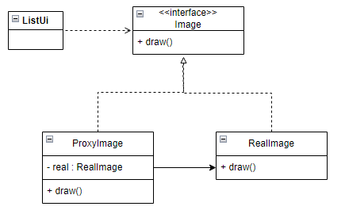

# 프록시패턴
- 실제객체를 대신하는 프록시 객체를 사용해서 실제 객체의 생성이나 접근 등을 제어할 수 있도록 해 주는 패턴이다.

<br>
- 위 그림에서 ProxyImage클래스가 프록시 역할을 한다.
```java
public class ProxyImage implements Image {
    private String path;
    private RealImage image;
    
    public ProxyImage(Strin path) {
        this.path = path;
    }
    
    public void draw() {
        if (image == null) {
            image = new realImage(path); // 최초 접근 시 객체 생성
        }
        image.draw(); // RealImage 객체에 위임
    }
}
```
- ProxyImage 클래스는 draw() 메서드가 최초로 호출될때 RealImage 객체를 생성하고<br>
그 뒤에 생성된 RealImage 객체의 draw() 메서드를 호출한다.<br><br>

```java
public class RealImage implements Image {
    private String path;

    public RealImage(String path) {
        this.path = path;
        loadImage();
    }

    @Override
    public void draw() {
        // 이미지를 출력하는 로직
    }
}
```

```java
public class ListUi {
    private List<Imgae> images;
    
    public ListUi(List<Image> images) {
        this.images = images;
    }
    
    public void onScroll(int start, int end) {
        // 스크롤 시, 화면에 표시되는 이미지를 표시
        for (int i = start; i <= end; i++) {
            Image image = images.get(i);
            image.draw();
        }
    }
}
```
- images 필드에 Image 객체가 프록시 객체인 경우, <br>
프록시 객체는 최초에 draw() 메서드가 실행될때 RealImage 객체를 생성한다. <br>
draw() 메서드 호출 전까지 객체를 생성하지 않기때문에 불필요한 메모리 낭비를 방지할 수 있다. <br>
또한 ListUi를 변경하지 않아도, 이미지 로딩 방식을 변경할 수 있게 된다. <br>

```java
public class Main {
    public static void main(String[] args) {
        List<String> paths = new ArrayList<>(); // 이미지 경로 목록
        paths.add("image1.jpg");
        paths.add("image2.jpg");
        paths.add("image3.jpg");
        paths.add("image4.jpg");
        paths.add("image5.jpg");

        List<Image> images = new ArrayList<>(paths.size());
        for (int i = 0; i < paths.size(); i++) {
            if (i <= 3) {
                images.add(new RealImage(paths.get(i)));  // 초기에 4개 이미지는 바로 로드
            } else {
                images.add(new ProxyImage(paths.get(i)));  // 나머지는 프록시로 지연 로드
            }
        }

        ListUi listUi = new ListUi(images);

        // 예시: 스크롤 범위 내의 이미지를 표시
        listUi.onScroll(0, 2); // 이미지 0~2를 화면에 그리기
        listUi.onScroll(3, 5); // 이미지 3~5를 화면에 그리기
    }
}

```
- ProxyImage 처럼 필요한 순간에 실제 객체를 생성해 주는 프록시를 가상프록시라고 한다. <br>
이 외에도 실제 객체에 대한 접근을 제어하는 보호 프록시,<br>
다른 프로세스에 존재하는 객체에 접근할 때 사용되는 원격프록시가 있다.

## 프록시 패턴을 적용할 때 고려할 점
- 프록시를 구현할때 실제 객체를 누가 생성할 것이냐를 고려해야 한다. <br>
가상 프록시에서는 프록시 클래스에서 직접 실제 객체를 생성한다. <br>
반면에 접근 제어를 위한 목적의 보호 프록시는 실제 객체의 타입을 알 필요 없이 추상 타입을 사용하면 된다.<br><br>

- 위임 방식이 아닌 상속을 사용하여 프록시를 구현 할 수 도 있다.<br>
상위 클래스의 메서드를 재정의 하는 방법으로 구현할 수 있다.<br>
상속방식은 구조가 단순해서 구현이 쉽지만 프록시 객체를 생성하는 순간 실제객체가 생성되므로, 가상프록시 구현은 적합하지 않다.<br>
```java
public class ProtectedService extends Service {
    @Override
    public void someMethod() {
        if (! CurrentContext.getAuth().isAdmin())
            throw new AccessDeniedException();
        
        super.someMethod();
    }
}
```
> 위임 기반의 프록시 패턴은 데코레이터 패턴과 유사하지만<br>
> 프록시 패턴은 실제 객체에 대한 접근제어에 초점을 맞춘다.<br>
> 반면 데코레이터 패턴은 기능을 확장하는 것이 목적이다. <br>
> 기능에 맞게 단어를 선택해야 한다.